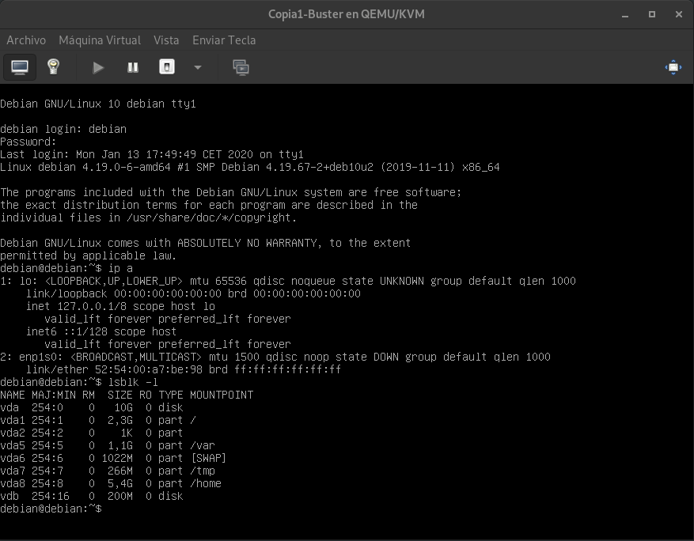

# Migración de una máquina virtual con libvirt

Realiza el proceso de migración de una máquina virtual que está ejecutando un servicio PostgreSQL desde tu propio hipervisor al situado en la dirección 172.22.200.10, estando en todo momento los datos del servidor PostgreSQL en un volumen independiente.

Cuanto mayor sea el nivel de automatismo de la tarea más alta será la calificación.

## FASE 1

- Crear una MV en libvirt/KVM de tu equipo conectado a una red interna que tenga salida por NAT usando la imagen de buster del NAS y con aprovisionamiento ligero (MV1)

- Configurar la RAM disponible a 500 MiB

-------------------------------------------------------

Para utilizar la herramientas que vamos a utilizar en esta tarea, tenemos que instalar algunos paquetes necesarios.

###### Instalamos los paquetes `qemu-kvm`, `libvirt-clients`, `libvirt-daemon-system`

~~~
sudo apt install virt-install qemu-kvm libvirt-clients libvirt-daemon-system virt-manager virt-install
~~~

Antes de crear la máquina virtual, tenemos que configurar la red NAT. Para crear la red NAT vamos a crear un fichero `.xml` y le indicamos la dirección que va a tomar la máquina y el rango del DHCP.

###### Creamos fichero `RedNAT.xml`
~~~
<network>
 <name>red_nat</name>
    <forward mode="nat"/>
    <ip address="10.10.10.1" netmask="255.255.255.0">
        <dhcp>
          <range start="10.10.10.1" end="10.10.10.30"/>
        </dhcp>
    </ip>
</network>
~~~

Ahora tenemos que definir la red e iniciarla para utilizarla posteriormente.

###### Definimos la red con el fichero creado

~~~
virsh -c qemu:///system net-define RedNAT.xml 
    Network red_nat defined from RedNAT.xml
~~~

###### Le indicamos que autoinicie
~~~
virsh -c qemu:///system net-define RedNAT.xml 
    Network red_nat defined from RedNAT.xml
~~~

###### Iniciamos la red
~~~
virsh -c qemu:///system net-start red_nat
    Network red_nat started
~~~

Listamos las redes que hay en este momento
~~~
virsh -c qemu:///system net-list
    
     Name      State    Autostart   Persistent
    --------------------------------------------
     red_nat   active   yes         yes
~~~

Ahora vamos a crear la máquina virtual, para hacer esto vamos a utilizar el comando `virt-install` indicandole varios parametros para que nuestra máquina tome forma.

> NOTA: La herramienta `virt-install` se instala junto al paquete `virtinst`.

###### Creamos la máquina con aprovisionamiento ligero e indicandole la red NAT
~~~
virt-install --connect qemu:///system --name Copia1-Buster \
--memory 500 --disk path=/home/moralg/MaquinaQemu/Copia1-Buster.qcow2 \
--vcpus=1 --boot hd --vnc --os-type linux --os-variant=debian10 \
--network network=red_nat --noautoconsole --hvm --keymap es
~~~

###### Salida al crear la máquina
~~~
Starting install...
Domain creation completed.
~~~

**Parametros**

> **--connect**: Le indicamos el acceso, que va ser, `qemu:///system`, acceso local a la instancia del sistema.
>
> **--name**: Nombre de la máquina que vamos a crear.
>
> **--memory**: Le indicamos la memoria RAM de la máquina, en este caso 500.
>
> **--disk path**: Indicamos el fichero `qcow2` con el cual vamos a realizar el aprovisionamiento ligero, si quieres saber como hacerlo haz clic [AQUÍ](https://github.com/MoralG/Trabajando_con_libvirt.KVM/blob/master/Trabajando_con_libvirt.KVM.md).
>
> **--vcpus**: Indicamos los procesos virtuales que va a utilizar
>
> **--boot**: Le indicamos donde va a arrancar.
>
> **network**: Indicamos la red creada anteriormente.

- Crear un fichero adicional de 200 MiB y conectarlo a MV1 a través de libvirt

-------------------------------------------------------

Vamos a crear un fichero de 200Mib, para añadirlo a la máquina. Se crea indicandole

###### Creamos el fichero `Vol-extra.img`
~~~
dd if=/dev/zero of=Vol-extra.img bs=1M count=200
    200+0 registros leídos
    200+0 registros escritos
    209715200 bytes (210 MB, 200 MiB) copied, 0,103026 s, 2,0 GB/s
~~~

**Parametros**

> **if=/dev/zero**: if significa lo "input file" que es lo que quieres copiar al `of`, en este caso quieres copiar un fichero limpio con `/dev/zero`.
>
> **of=Vol-extra.img**: of significa "outfut file" que es donde quieres copiar el `if`, le indicamos el nombre del fichero a crear.

> **bs=1M**: Con esto se consigue que tanto la lectura como la escritura se haga en bloques de 1 megabyte.

> **count=200** Indicamos el tamaño del fichero.

Ahora tenemos que añadirlo a la máquina `Copia1-Buster`.

###### Asociamos el fichero
~~~
virsh -c qemu:///system attach-disk Copia1-Buster \
--source /home/moralg/MaquinaQemu/Vol-extra.img \
--target vdb \
--persistent
~~~

###### Salida al asociar el fichero extra
~~~
Disk attached successfully
~~~

Ahora solo nos quedaría iniciar la máquina y cambiar la interfaz de red por defecto del fichero `/etc/network/interfaces` y asignarle el nombre que te sale al hacer un `ip a`

###### Iniciamos la máquina
~~~
virsh -c qemu:///system start Copia1-Buster
~~~

###### Cambiamos `ens3` por defecto por `enp1a0`
~~~
allow-hotplug enp1s0
iface enp1s0 inet dhcp
~~~

- Instalar PostgreSQL y ubicar el directorio /var/lib/postgresql en el volumen asociado al fichero adicional (muy importante comprobar permisos y propietarios)

- Poblar la base de datos

-------------------------------------------------------

Instalamos PostgreSQL en nuestra máquina de manera normal y luego configuramos la ruta `/var/lib/postgresql` para que este en el fichero extra de 200Mib.

###### Instalamos PostgreSQL
~~~
sudo apt-get install postgresql postgresql-contrib postgresql-client
~~~

Ahora vamos cambiar el nombre del fichero `/var/lib/postgresql` para crear una igual pero donde se monte el dispositivo de bloque extra, y ahi moveremos todos los fichero del antiguo directorio `postgresql`.

###### Cambiamos el nombre del directorio para que no tengamos conflicto
~~~
sudo mv /var/lib/postgresql /var/lib/postgresql-copy
~~~

###### Creamos una nueva carpeta con el mismo nombre `postgresql`
~~~
sudo mkdir /var/lib/postgresql
~~~

Modificamos el fichero `/etc/fstab` y añadimos una linea para el automontaje del disco nuevo que tenemos que particionar y formatear.

###### Creamos una partición completa del disco
~~~
sudo fdisk /dev/vdb

    Bienvenido a fdisk (util-linux 2.33.1).
    Los cambios solo permanecerán en la memoria, hasta que decida escribirlos.
    Tenga cuidado antes de utilizar la orden de escritura.

    El dispositivo no contiene una tabla de particiones reconocida.
    Se ha creado una nueva etiqueta de disco DOS con el identificador de disco 0x1a78615e.

    Orden (m para obtener ayuda): n
    Tipo de partición
       p   primaria (0 primaria(s), 0 extendida(s), 4 libre(s))
       e   extendida (contenedor para particiones lógicas)
    Seleccionar (valor predeterminado p): p
    Número de partición (1-4, valor predeterminado 1): 
    Primer sector (2048-409599, valor predeterminado 2048): 
    Último sector, +/-sectores o +/-tamaño{K,M,G,T,P} (2048-409599, valor predeterminado    409599): 

    Crea una nueva partición 1 de tipo 'Linux' y de tamaño 199 MiB.

    Orden (m para obtener ayuda): w
    Se ha modificado la tabla de particiones.
    Llamando a ioctl() para volver a leer la tabla de particiones.
    Se están sincronizando los discos.
~~~

###### Formateamos el disco
~~~
sudo mkfs.ext4 /dev/vdb1 
    mke2fs 1.44.5 (15-Dec-2018)
    Creating filesystem with 203776 1k blocks and 51000 inodes
    Filesystem UUID: 726d65ff-6d47-4fa5-ad52-3637162bbbea
    Superblock backups stored on blocks: 
    	8193, 24577, 40961, 57345, 73729

    Allocating group tables: done                            
    Writing inode tables: done                            
    Creating journal (4096 blocks): done
    Writing superblocks and filesystem accounting information: done 
~~~

###### Añadimos la linea de automontaje en el fichero `/etc/fstab`
~~~
UUID=726d65ff-6d47-4fa5-ad52-3637162bbbea /var/lib/postgresql   ext4    defaults    0   2
~~~

###### Hacemos que lea de nuevo el fichero de `/etc/fstab`
~~~
sudo mount -a
~~~

###### Comprobamos que esta montado correctamente
~~~
lsblk -l
    NAME MAJ:MIN RM  SIZE RO TYPE MOUNTPOINT
    vda  254:0    0   10G  0 disk 
    vda1 254:1    0  2,3G  0 part /
    vda2 254:2    0    1K  0 part 
    vda5 254:5    0  1,1G  0 part /var
    vda6 254:6    0 1022M  0 part [SWAP]
    vda7 254:7    0  266M  0 part /tmp
    vda8 254:8    0  5,4G  0 part /home
    vdb  254:16   0  200M  0 disk 
    vdb1 254:17   0  199M  0 part /var/lib/postgresql
~~~

Por último tenemos que copiar todos el contenido de un directorio al del disco montado y cambiar el propietario del nuevo directorio de manera recursiva.

###### Copiamos los ficheros de `/var/lib/postgresql-copy` a `/var/lib/postgresql`
~~~
sudo cp -r /var/lib/postgresql-copy/* /var/lib/postgresql
~~~

###### Cambiamos el propietario del nuevo directorio
~~~
sudo chown -R postgres:postgres /var/lib/postgresql
~~~

- Crear una regla de iptables que redirija las peticiones al puerto 5432/tcp que se realicen desde fuera a MV1 para que la base de datos sea accesible desde el exterior.

-------------------------------------------------------

Para que se pueda acceder de forma remota a la base de datos de PostgreSQL, ademas de las reglas de iptables, tenemos que modificar algunos ficheros.

###### Añadimos la siguiente linea al fichero `/etc/postgresql/11/main/pg_hba.conf`
~~~
host    all             all             10.10.10.0/24          md5
~~~

###### Descomentamos la linea `#listen_addresses = 'localhost'` del fichero `/etc/postgresql/11/main/postgresql.conf` y la modificamos de la siguiente forma:

~~~
listen_addresses = '*'
~~~

###### Reiniciamos los servicios
~~~
sudo systemctl restart postgresql@11-main.service
sudo systemctl restart postgresql.service
~~~

~~~
psql -h 10.10.10.12 -U debian -d debiandb
~~~

###### Creamos las reglas de iptables necesarias
~~~
iptables -t nat -A PREROUTING -p tcp --dport 5432 -i wlp2s0 -j DNAT --to 10.10.10.12
iptables -t nat -A POSTROUTING -p tcp --sport 5432 -s 10.10.10.0/24 -j MASQUERADE
~~~

- Crear un registro en el DNS para el servicio

## FASE 2

- Monitorizar el uso de RAM de MV1 de manera que comience la migración en el momento que el uso de RAM supere el 90%
- Crear una MV en libvirt/KVM remoto conectado a la red interna 10.0.1.0/24 que tiene salida por NAT usando la imagen de buster del NAS y con aprovisionamiento ligero (MV2)
- Configurar la RAM disponible para MV2 a 1 GiB
- Instalar PostgreSQL en MV2
- Crear una regla de iptables que redirija las peticiones al puerto 5432/tcp que se realicen desde fuera a MV2 para que la base de datos sea accesible desde el exterior.
- Parar el servicio PostgreSQL en MV1
- Desconectar el volumen adicional de MV1, redimensionarlo a 400 MiB (también el sistema de ficheros), copiarlo y conectarlo a MV2.
- Montar el volumen adicional en /var/lib/postgresql y reiniciar el servicio PostgreSQL en KVM verificando permisos y propietarios.
- Actualizar el registro DNS para que el servicio lo preste ahora MV2
- Comprobar el funcionamiento

## [FASE 3]()

- Monitorizar MV2 y cuando el uso de RAM llegue al 90%, subir la RAM asignada a 2 GiB en vivo.

~~~
iptables -t nat -A PREROUTING -p tcp --dport 5432 -i wlo1 -j DNAT --to 10.20.10.43
iptables -t nat -A POSTROUTING -p tcp --sport 5432 -s 10.20.10.0/24 -j MASQUERADE
~~~