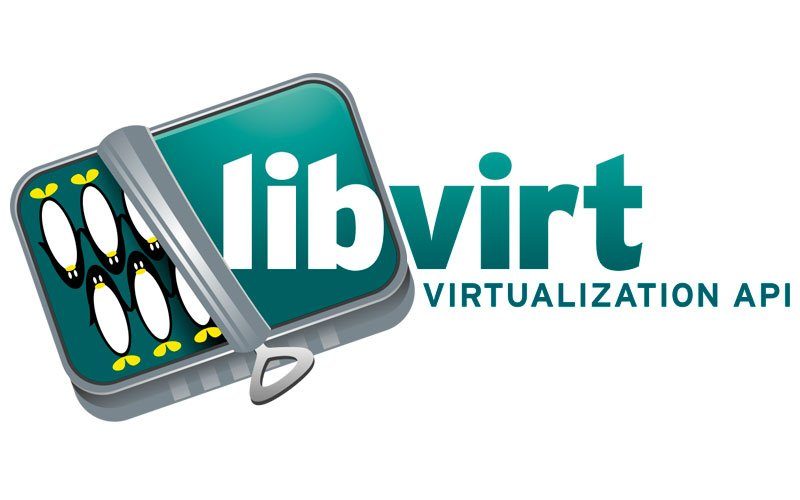

# Migración de una máquina virtual con libvirt

Realiza el proceso de migración de una máquina virtual que está ejecutando un servicio PostgreSQL desde tu propio hipervisor al situado en la dirección 172.22.200.10, estando en todo momento los datos del servidor PostgreSQL en un volumen independiente.

Cuanto mayor sea el nivel de automatismo de la tarea más alta será la calificación.

### [FASE 1](https://github.com/MoralG/Migracion_de_MV_con_libvirt/blob/master/Migracion_de_MV_con_libvirt.md#fase-1)
- Crear una MV en libvirt/KVM de tu equipo conectado a una red interna que tenga salida por NAT usando la imagen de buster del NAS y con aprovisionamiento ligero (MV1).
- Configurar la RAM disponible a 500 MiB
- Crear un fichero adicional de 200 MiB y conectarlo a MV1 a través de libvirt
- Instalar PostgreSQL y ubicar el directorio /var/lib/postgresql en el volumen asociado al fichero adicional (muy importante comprobar permisos y propietarios)
- Poblar la base de datos
- Crear una regla de iptables que redirija las peticiones al puerto 5432/tcp que se realicen desde fuera a MV1 para que la base de datos sea accesible desde el exterior.
- Crear un registro en el DNS para el servicio

### [FASE 2](https://github.com/MoralG/Migracion_de_MV_con_libvirt/blob/master/Migracion_de_MV_con_libvirt.md#fase-2)

- Monitorizar el uso de RAM de MV1 de manera que comience la migración en el momento que el uso de RAM supere el 90%
- Crear una MV en libvirt/KVM remoto conectado a la red interna 10.0.1.0/24 que tiene salida por NAT usando la imagen de buster del NAS y con aprovisionamiento ligero (MV2).
- Configurar la RAM disponible para MV2 a 1 GiB
- Instalar PostgreSQL en MV2
- Crear una regla de iptables que redirija las peticiones al puerto 5432/tcp que se realicen desde fuera a MV2 para que la base de datos sea accesible desde el exterior.
- Parar el servicio PostgreSQL en MV1
- Desconectar el volumen adicional de MV1, redimensionarlo a 400 MiB (también el sistema de ficheros), copiarlo y conectarlo a MV2.
- Montar el volumen adicional en /var/lib/postgresql y reiniciar el servicio PostgreSQL en KVM verificando permisos y propietarios.
- Actualizar el registro DNS para que el servicio lo preste ahora MV2
- Comprobar el funcionamiento

### [FASE 3](https://github.com/MoralG/Migracion_de_MV_con_libvirt/blob/master/Migracion_de_MV_con_libvirt.md#fase-3)

- Monitorizar MV2 y cuando el uso de RAM llegue al 90%, subir la RAM asignada a 2 GiB en vivo.
